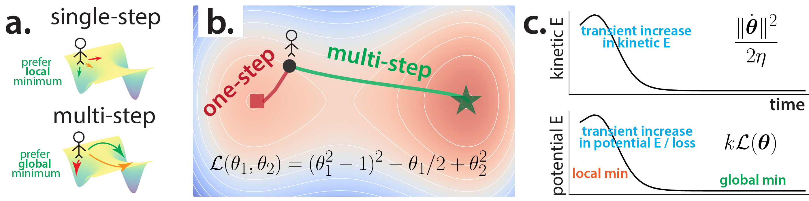
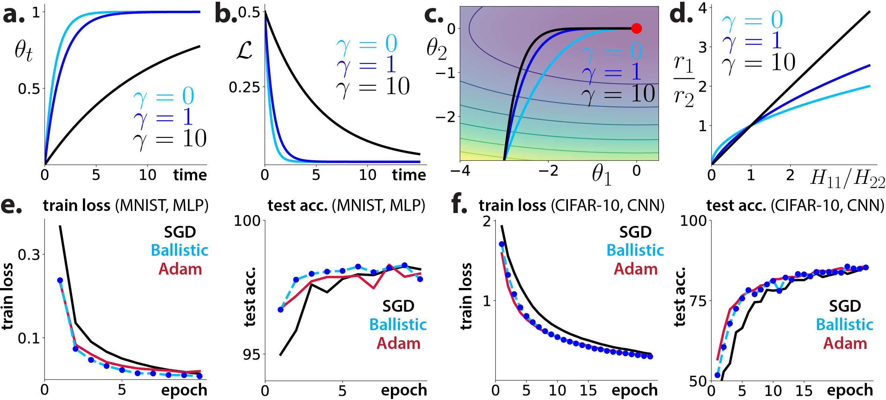
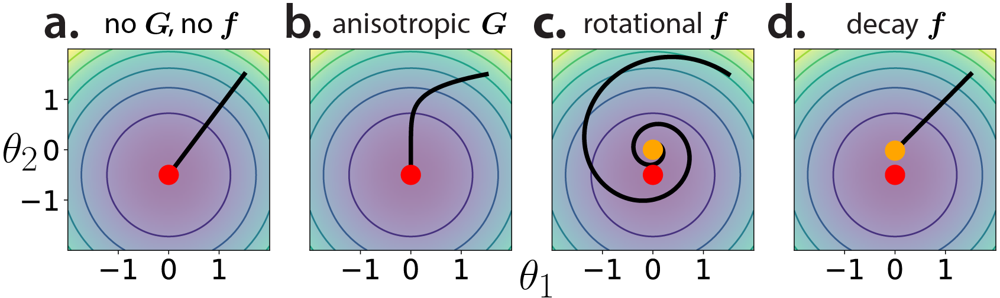

# Gradient Descent as Loss Landscape Navigation: a Normative Framework for Deriving Learning Rules (NeurIPS 2025)

<div align="center"><a href="https://openreview.net/forum?id=oMi4uyNOlL">OpenReview</a> &nbsp; | &nbsp;
<a href="https://arxiv.org/abs/2510.26997">arXiv</a> </div>
<br/>

<p align="center">John J. Vastola, Samuel J. Gershman, and Kanaka Rajan</p>

This repo contains code that reproduces the figures from "**Gradient Descent as Loss Landscape Navigation: a Normative Framework for Deriving Learning Rules**", a paper accepted to NeurIPS 2025.

**Abstract:**
> Learning rules---prescriptions for updating model parameters to improve performance---are typically assumed rather than derived. Why do some learning rules work better than others, and under what assumptions can a given rule be considered optimal? We propose a theoretical framework that casts learning rules as policies for navigating (partially observable) loss landscapes, and identifies optimal rules as solutions to an associated optimal control problem. A range of well-known rules emerge naturally within this framework under different assumptions: gradient descent from short-horizon optimization, momentum from longer-horizon planning, natural gradients from accounting for parameter space geometry, non-gradient rules from partial controllability, and adaptive optimizers like Adam from online Bayesian inference of loss landscape shape. We further show that continual learning strategies like weight resetting can be understood as optimal responses to task uncertainty. By unifying these phenomena under a single objective, our framework clarifies the computational structure of learning and offers a principled foundation for designing adaptive algorithms.

The paper is mostly theoretical and the code involves only simple examples, so only standard libraries (NumPy, SciPy, Pytorch, and Matplotlib) are used.

There is one Jupyter notebook per figure:

**1.** `fig1-overview.ipynb` Contains code for generating Figure 1, "Basic idea of our framework and a simple example".

<p align="center">
</p>

**2.** `fig2-momentum.ipynb` Contains code for generating Figure 2, "Effect of modulating temporal discounting rate".

<p align="center">
</p>

**3.** `fig3-nongrad.ipynb` Contains code for generating Figure 3, "Parameter space geometry affects optimal learning trajectories".

<p align="center">
</p>


Files containing important functions used by the above notebooks are in the `functions/` folder. Intended notebook outputs are in the `results/` folder.

## Citation

```bibtex
@inproceedings{
vastola2025gradient,
title={Gradient Descent as Loss Landscape Navigation: a Normative Framework for Deriving Learning Rules},
author={John Vastola and Samuel J. Gershman and Kanaka Rajan},
booktitle={The Thirty-ninth Annual Conference on Neural Information Processing Systems},
year={2025},
url={https://openreview.net/forum?id=oMi4uyNOlL}
}
```
